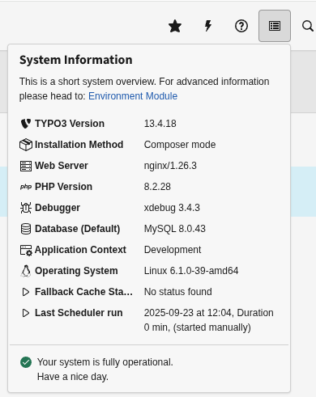

# What does it do?

In simple words - it makes your Website reachable still if your cache does not work. Think about a network issue on the provider side where your Redis Cluster should be reachable. Or someone updates your SQL Cluster, configured for the TYPO3 Instance and did not tell you!
Also, the fallback cache ensures components to be still cached, to reduce system load.

In addition, the Cache itself has a new Interface it can implement and tell this Extension it went bad:
- The cache could control its velocity
- It could check if it gets out of space
- It could be gracefully down for maintenance
- The cache backend was shut down in panic as a new security issue found
- Someone pulled the plug to do some vacuuming in the server room

After the fallback period the cache on the primary system is outdated and has to be cleared!

# Recommendation

It is recommended to set
```PHP
$GLOBALS['TYPO3_CONF_VARS']['SYS']['Objects'][CacheManager::class] = [ 'className' => \Weakbit\FallbackCache\Cache\CacheManager::class ];
```
in additional.php or the equivalent settings.php file.

This ensures the override is applied early and reliably, avoiding issues with loading order or race conditions that can occur if set in extension files like ext_localconf.php.

## Example
This defines a pages cache with the fallback cache: pages_fallback.

To catch exceptions a variable frontend is set that sents a event with status yellow on exception.

```PHP
$GLOBALS['TYPO3_CONF_VARS']['SYS']['caching']['cacheConfigurations']['pages'] = [
    // This frontend surrounds the functions by a try, and sends an event on exception (Status yellow)
    'frontend' => \Weakbit\FallbackCache\Cache\Frontend\VariableFrontend::class,
    'backend' => RedisBackend::class,
    'options' => [
        'defaultLifetime' => 604800,
        'compression' => 0,
    ],
    // If the cache creation fails (Status red) this cache is used 
    'fallback' => 'pages_fallback',
    // The concrete frontend the 'frontend' is based on
    'concrete_frontend' => \TYPO3\CMS\Core\Cache\Frontend\VariableFrontend::class,
    'groups' => [
        'pages',
    ]
];

// Configure the fallback cache to use the database for example
$GLOBALS['TYPO3_CONF_VARS']['SYS']['caching']['cacheConfigurations']['pages_fallback'] = $GLOBALS['TYPO3_CONF_VARS']['SYS']['caching']['cacheConfigurations']['pages'];
$GLOBALS['TYPO3_CONF_VARS']['SYS']['caching']['cacheConfigurations']['pages_fallback']['backend'] = Typo3DatabaseBackend::class;
$GLOBALS['TYPO3_CONF_VARS']['SYS']['caching']['cacheConfigurations']['pages_fallback']['options'] = [
    'defaultLifetime' => 604800,
];
```

You can *chain* them and also define a fallback for the fallback cache.

You could end the chain with a cache with the NullBackend, if that also fails the hope for this TYPO3 request is lost. But using no cache may bring down your server, but that depends on the server and application.

## Immutable Cache Configuration

This extension provides the ability to mark certain caches as "immutable", which means they will not be affected by cache flushing operations. This is particularly useful for caches that contain data that rarely changes and is expensive to regenerate, such as compiled templates, code caches, or reference data.

⚠️ **WARNING**: Immutable caches must be manually managed by developers. The system will NOT automatically clear these caches during regular maintenance operations!

### How to Configure Immutable Caches

To mark a cache as immutable, add the `tags` configuration with the `immutable` property set to `true`:


```PHP
$GLOBALS['TYPO3_CONF_VARS']['SYS']['caching']['cacheConfigurations']['my_immutable_cache'] = [
    'frontend' => \TYPO3\CMS\Core\Cache\Frontend\VariableFrontend::class,
    'backend' => \TYPO3\CMS\Core\Cache\Backend\FileBackend::class,
    'options' => [
        'defaultLifetime' => 604800,
    ],
    'groups' => [
        'system',
    ],
    'tags' => [
        ['name' => 'cache', 'identifier' => 'my_immutable_cache', 'immutable' => true]
    ]
];
```

### Behavior of Immutable Caches

When a cache is marked as immutable:

1. It will **not** be cleared when `flushCaches()` is called
2. It will **not** be cleared when `flushCachesByTag()` is called with any tags
3. It will **not** be cleared when `flushCachesInGroup()` is called, even if the cache belongs to that group

This feature ensures that important cache entries remain available even during maintenance operations or when other parts of the system trigger cache flushes.

### When to Use Immutable Caches

Consider using immutable caches for:

- Compiled templates or CSS/JS assets that rarely change
- Code caches that are expensive to regenerate
- Core configuration data that is only updated during system upgrades
- Any cache data where regeneration would cause significant load on the system

When you need to update an immutable cache, you'll need to manually clear it using direct backend operations or by temporarily removing the immutable flag.

# How to Access the Cache Status

1. Log in to your TYPO3 backend
2. Look at the top toolbar (the black bar at the top of the screen)
3. Find the system information icon (typically shows system details like TYPO3 version)
4. Click on this icon to see a dropdown menu
5. The cache status will be displayed



# TODO

- [ ] Refactor addCacheStatus to comply with external calls

# Credits

Inspired by https://packagist.org/packages/b13/graceful-cache

Uses code from https://github.com/marketing-factory/typo3_prometheus